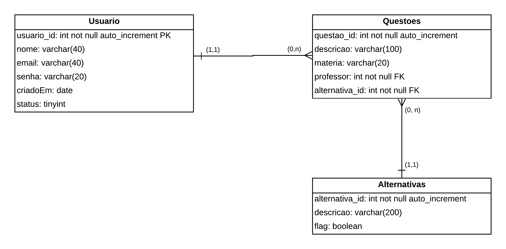

# Cadastro Usuario API

Projeto realizado para teste na empresa **Fill Tecnologia**.

### Modelagem de dados

  

Para testar o projeto

- execute npm install para instalar as dependências;
> npm install

 

Dependências | Versão 
-----------  | ------
cors         | ^2.8.5
express      | ^4.18.2
typescript   | ^5.2.2

Dependências de Desenvolvimento | Versão
------------------------------- | -------
@types/cors                     | ^2.8.14
@types/express                  | ^4.17.18
@types/node                     | ^20.8.2
ts-node-dev                     | ^2.0.0
mysql2                          | ^3.6.1

SGBD  | Tipo | Versão
----  | ---- | --------
MySQL | SQL  | 8.0

 

A ORM utilizada para manipular as informações

ORM               | Versão
-----             | ---------
TypeORM           | ^0.3.17
reflect-metadata  | ^0.1.13 